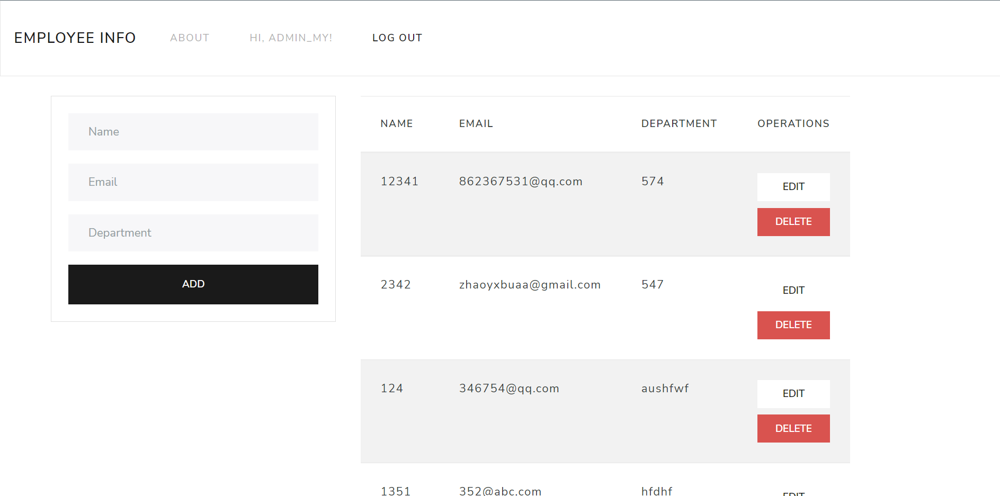

# 基于Python Flask, React和SQLite的员工管理系统



## 目录

#### &sect; [功能](#features)

#### &sect; [快速开始](#getting-started)
  * [安装](#installation)
  * [启动](#start)
  
#### &sect; [技术栈](#tech)
  * [前端](#frontend)
  * [后端](#backend)
  * [数据库](#database)

#### &sect; [项目架构](#architecture)
  * [MVC三层架构](#layers)
  * [目录结构](#tree)
  
#### &sect; [测试](#testing)  
#### &sect; [部署](#deployment)
#### &sect; [参考](#reference)

****

## <a name="features">&sect; 功能</a> 
* 对Employee表中记录的增/删/改/查操作
* 用户注册/登录/登出
* 系统操作日志
* 用户权限管理 (Ongoing)  

角色及其权限设计：  

|  角色   | 权限  |
|  ----  | ----  |
| 普通员工  | 查 |
| 管理员  | 增/删/改/查 |
| 超级管理员  | 增/删/改/查 + 查看操作日志 |

***

## <a name="getting-started">&sect; 快速开始</a>

### <a name="installation">⊙ 安装</a>

后端依赖：在`backend`目录下：执行`pip install -r requirements.txt`  
前端依赖：在`frontend`目录下： 执行`npm install`

### <a name="start">⊙ 启动</a>
后端启动：在`backend/src`目录下：执行`python app.py`  
前端启动：在`frontend`目录下： 执行`npm start`  
如无意外，默认浏览器就会自动打开 `localhost:3000`，若浏览器没有自动弹出，则请自行手动访问  

***

## <a name="tech">&sect; 技术栈</a>  

### <a name="frontend">⊙ 前端</a>  
* React 18.2.0 前端开发框架
* React Bootstrap UI库
* React Router 响应式路由
* React Hook Form 表单验证库
* React Token Auth 登录验证库(Token)

### <a name="backend">⊙ 后端</a>  
* Python Flask 后端开发框架
* flask_restful 建立REST APIs
* flask_jwt_extended Server端Token校验
* flask_sqlalchemy 数据库交互
* werkzeug.security 密码加密及校验

### <a name="database">⊙ 数据库</a>
* SQLite3

***

## <a name="architecture">&sect; 项目架构</a>

### <a name="layers">⊙ MVC三层架构</a>
* View: 视图层，即展示给用户的界面，与用户直接进行交互；
* Controller: 控制层，接收用户端的输入并调用模型去完成用户的需求，并将处理结果返回至视图层；
* Model: 模型层，提供与数据库交互的能力；

### <a name="tree">⊙ 目录结构</a>
```
.
│  package-lock.json
│  README.md
│  screenshot.png
│
├─backend 
│  │─src
│      │  app.py      //Controller
│      │  models.py   //Model
│      │  myweb.db
│      │  settings.py
│  │   requirements.txt
│              
├─frontend            //View
│  │─node_modules 
│  │─public  
│  │─src
│      │   App.css
│      │   App.js
│      │   App.test.js
│      │   auth.js
│      │   index.css
│      │   index.js
│      │   logo.svg
│      │   serviceWorker.js
│      │   setupTests.js
│      │
│      │-components
│           │   About.js
│           │   Employee.js
│           │   Login.js
│           │   Navbar.js
│           │   OpsLog.js
│           │   SignUp.js
│  │   .env
│  │   .gitignore
│  │   package-lock.json
│  │   package.json
│  │   README.md
```

***

## <a name="testing">&sect; 测试</a>
* To be updated  

***

## <a name="deployment">&sect; 部署</a>
* To be updated  

***

## <a name="reference">&sect; 参考</a>
* To be updated
