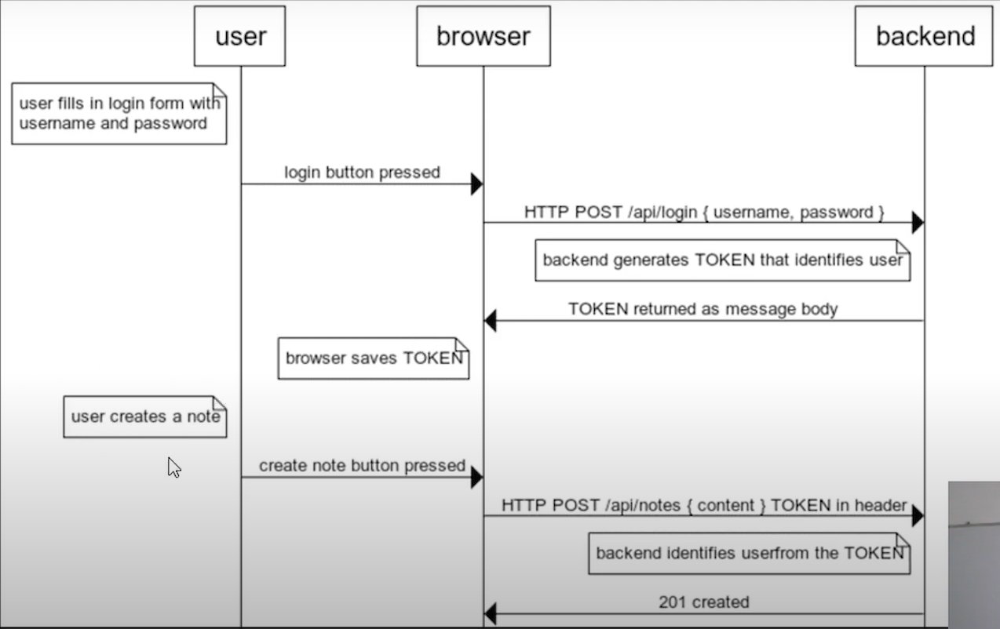

# 基于Flask + React的数据库CRUD工具


## 目录

#### &sect; [项目简介](#intro)
  * [简介](#summary)
  * [功能及实现](#features)

#### &sect; [快速开始](#getting-started)
  * [安装](#installation)
  * [启动](#start)
  
#### &sect; [技术栈](#tech)
  * [前端](#frontend)
  * [后端](#backend)

#### &sect; [项目架构](#architecture)
  * [MVC三层架构](#layers)
  * [目录结构](#tree)
   
#### &sect; [部署](#deployment)
#### &sect; [参考](#reference)

****

## <a name="intro">&sect; 项目简介</a>

### <a name="summary">⊙ 简介</a> 
本项目是一个基于Flask + React搭建的数据库CRUD工具，项目采用前后端分离的架构，符合MVC模式，功能完整，可支持多种数据库，并已部署至Heroku。用户输入数据库配置信息后，可选择相应数据表和字段进行前端显示和增/删/改/查操作；此外，项目还实现了登录注册、查看系统操作日志、用户权限管理等功能。

### <a name="features">⊙ 功能及实现</a> 
* 自动获取数据库中所有数据表及其字段信息，并配置前端显示的字段
> 利用Sqlalchemy中的Automap实现自动映射数据库中已经有的表和字段信息(MetaData)
* 对选定数据表中记录的增/删/改/查操作
> 基于flask_restful建立REST APIs，利用flask_sqlalchemy提供的数据库操纵能力来实现增/删/改/查操作
* 用户注册/登录/登出
> 前端登录注册的表单构建：React Hook Form
> 
> 前端用户登录状态和Token管理：React Token Auth
> 
> 后端Token校验：flask_jwt_extended
>
>Token验证流程：  
* 系统操作日志
> 在增/删/改操作的后端接口中将当前操作信息插入至操作日志表，并在前端配置查看操作日志的页面
* 用户权限管理 
> 两种角色：用户和管理员； 两种权限：增/删/改/查 和 管理员权限
> 
> 用户可拥有增/删/改/查权限，默认用户仅拥有查看权限；管理员可为用户分配权限，或为用户赋予管理员权限
> 
> 为每种权限设置独立的权限位，校验时利用位与计算，即可实现仅通过一个权限字段来控制多种权限
> 
> 权限位设计：  
> 
> |  操作   | 权限位  |
> |  ----  | ----  |
> | 查  | 0b00000001 (0x01) |
> | 增  | 0b00000010 (0x02) |
> | 改  | 0b00000100 (0x04) |
> | 删  | 0b00001000 (0x08) |
> | 管理  | 0b10000000 (0x80) |
>
> 操作的权限使用 8 位表示，现在使用了其中5位，其余3位可用于将来的扩充


***

## <a name="getting-started">&sect; 快速开始</a>

### <a name="installation">⊙ 安装</a>

后端依赖：在`backend`目录下：执行`pip install -r requirements.txt`  
前端依赖：在`frontend`目录下： 执行`npm install`

### <a name="start">⊙ 启动</a>
后端启动：在`backend/src`目录下：执行`python app.py`  
前端启动：在`frontend`目录下： 执行`npm start`  
如无意外，默认浏览器就会自动打开 `localhost:3000`，若浏览器没有自动弹出，则请自行手动访问  

***

## <a name="tech">&sect; 技术栈</a>  

### <a name="frontend">⊙ 前端</a>  
* React 18.2.0 前端开发框架
* React Bootstrap UI组件库
* React Router 响应式路由
* React Hook Form 表单验证库
* React Token Auth 登录验证库(Token)

### <a name="backend">⊙ 后端</a>  
* Python Flask 后端开发框架
* flask_restful 建立REST APIs
* flask_jwt_extended Server端Token校验
* flask_sqlalchemy & Sqlalchemy 数据库交互
* werkzeug.security 密码加密及校验
* gunicorn  Python WSGI Server

***

## <a name="architecture">&sect; 项目架构</a>

### <a name="layers">⊙ MVC三层架构</a>
* View: 视图层，即展示给用户的界面，与用户直接进行交互；
* Controller: 控制层，接收用户端的输入并调用模型去完成用户的需求，并将处理结果返回至视图层；
* Model: 模型层，提供与数据库交互的能力；

### <a name="tree">⊙ 目录结构</a>
```
.
│  package-lock.json
│  README.md
│
├─backend 
│  │─src
│      │  app.py      //Controller
│      │  models.py   //Model
│      │  myweb.db    //项目数据库
│      │  ano.db      //用户自定义数据库，测试用
│      │  settings.py  //app配置，公共组件
│  │   requirements.txt
│  │   Profile       //gunicorn配置
│              
├─frontend            //View
│  │─node_modules 
│  │─public  
│  │─src
│      │   App.css
│      │   App.js
│      │   App.test.js
│      │   auth.js
│      │   index.css
│      │   index.js
│      │   logo.svg
│      │   serviceWorker.js
│      │   setupTests.js
│      │
│      │-components     //页面组件
│           │   About.js
│           │   Dbsetting.js
│           │   Items.js
│           │   Login.js
│           │   Navbar.js
│           │   OpsLog.js
│           │   Permission.js
│           │   SignUp.js
│  │   .env
│  │   .gitignore
│  │   package-lock.json
│  │   package.json
│  │   README.md
```

***

## <a name="deployment">&sect; 部署</a>
在`frontend`目录下： 执行 `npm run build`，将会在该目录下生成 `build/`文件夹  
> 在本地使用命令行静态资源服务器[serve](https://github.com/tj/serve) ( `npm i serve -g` )运行build 后的项目：执行 `serve -s build`
> 
> 生产环境下的部署：本项目部署至Heroku，可参考[Heroku with Git](https://devcenter.heroku.com/articles/git#create-a-heroku-remote)

***

## <a name="reference">&sect; 参考</a>
* [react文档](http://reactjs.cn/react/docs/getting-started-zh-CN.html)
* [react-bootstrap组件文档](https://react-bootstrap.github.io/layout/breakpoints/)
* [React Hook Form表单验证](https://react-hook-form.com/get-started)
* [React Token Auth (v2) 前端登录验证](https://github.com/obabichev/react-token-auth)
* [flask_restful文档](https://flask-restful.readthedocs.io/en/latest/quickstart.html)
* [flask_jwt_extended 后端登录验证](https://flask-jwt-extended.readthedocs.io/en/stable/basic_usage/)
* [Sqlalchemy Automap 自动映射数据库metadata](https://docs.sqlalchemy.org/en/14/orm/extensions/automap.html?highlight=automap#sqlalchemy.ext.automap.AutomapBase)
* [JWT登录校验](https://www.youtube.com/watch?v=GXVvBU_Vynk&list=PLEt8Tae2spYkfEYQnKxQ4vrOULAnMI1iF&index=2)
* [项目参考-DB Graph](https://github.com/bbelderbos/sa-graph)
* [Heroku with Git](https://devcenter.heroku.com/articles/git#create-a-heroku-remote)
* [Heroku部署Flask+React项目](https://www.youtube.com/watch?v=h96KP3JMX7Q)
